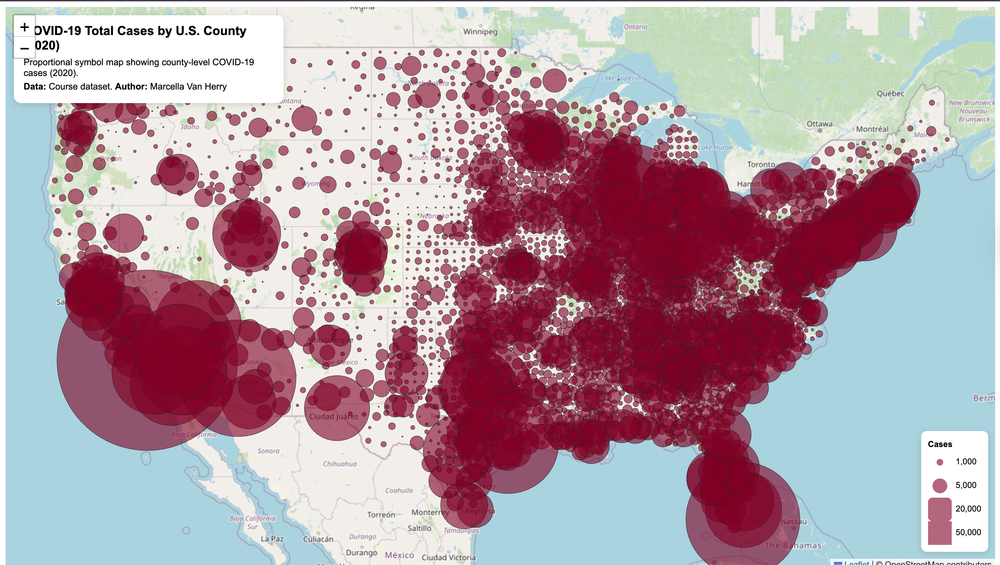

# covid-web-maps
# COVID-19 Web Mapping Project (2020)

## Project Overview
This project presents two interactive web maps visualizing county-level COVID-19 data in the United States for the year 2020. The objective of this project is to explore spatial patterns of COVID-19 using different thematic mapping techniques in a web-based environment.

The project includes:
- A choropleth map representing COVID-19 rates by county
- A proportional symbol map representing total COVID-19 case counts by county

Both maps are developed using Leaflet and are hosted on GitHub Pages.

---

## Live Maps
- **Choropleth Map (COVID-19 Rates):**  
  https://mrcllvnh.github.io/covid-web-maps/map1.html

- **Proportional Symbols Map (COVID-19 Cases):**  
  https://mrcllvnh.github.io/covid-web-maps/map2.html

---

## Screenshots

### Choropleth Map – COVID-19 Rates

### Proportional Symbols Map – COVID-19 Cases

---

## Map Functions and Features

### Choropleth Map
- County-level choropleth visualization based on COVID-19 rates
- Sequential color scheme to represent increasing rate values
- Interactive hover and click popups displaying county name, state, rates, cases, and deaths
- Legend explaining the classification of rate values

### Proportional Symbols Map
- Proportional circle symbols representing total COVID-19 cases by county
- Symbol sizes scaled using a square-root transformation to reduce visual bias
- Interactive clickable popups displaying county name, state, cases, and deaths
- Custom legend illustrating relative symbol sizes

The proportional symbol scaling and legend implementation extend beyond the basic examples covered in lectures.

---

## Libraries and Tools Used
- **Leaflet.js** – interactive web mapping framework
- **OpenStreetMap** – basemap tiles
- **Mapshaper** – data cleaning, attribute filtering, and geometry simplification
- **GitHub Pages** – project hosting and deployment

---

## Data Sources
- U.S. county-level COVID-19 datasets provided as part of the course materials
- County boundary shapefiles converted to GeoJSON format for web visualization

---

## File Structure

covid-web-maps/
│── map1.html
│── map2.html
│── README.md
├── assets/
│   ├── us-covid-2020-rates.geojson
│   └── us-covid-2020-counts.geojson
├── css/
│   └── style.css
├── img/
│   ├── map1.png
│   └── map2.png
└── js/
    ├── map1.js
    └── map2.js

---

## Author
Marcella Van Herry

---

## Acknowledgments
This project was completed as part of Lab 3: Web Map Application. Course tutorials and lecture materials provided guidance on thematic mapping techniques and web-based map development.
